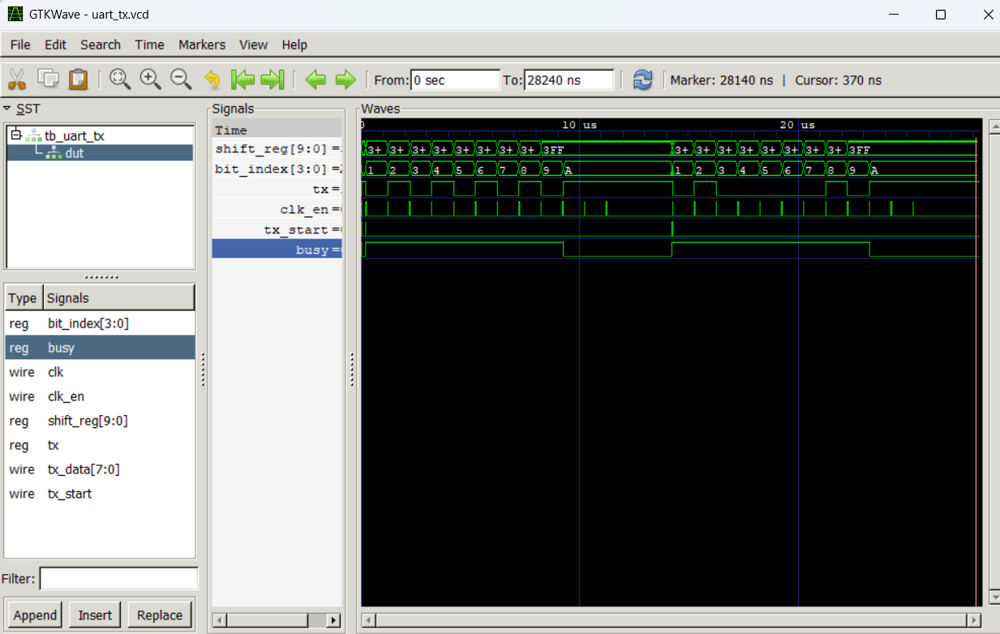

# UART Transmitter

This document describes the UART transmit (TX) module implemented as part
of the FPGA signal processing project.

The design follows a clock-enable driven architecture to avoid introducing
multiple clock domains and to ensure deterministic timing.

## Design Overview

- 8N1 UART format (1 start bit, 8 data bits, 1 stop bit)
- LSB-first data transmission
- Idle-high TX line
- Busy flag to prevent overlapping transmissions
- Baud timing controlled externally via a clock-enable pulse

## Simulation Verification

The UART transmitter was verified in simulation using a dedicated testbench
that generates a baud-rate clock-enable signal.

Known test values were transmitted to validate correct operation.

The simulation confirms:
- idle-high TX line
- correct start bit assertion
- 8 data bits transmitted LSB-first
- correct stop bit
- busy flag asserted for the full frame duration

